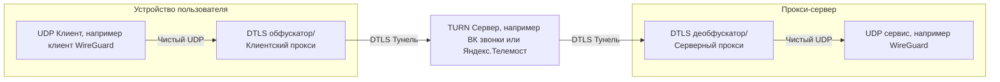

# TURN Proxy

## Отказ от ответственности (дисклеймер)

Данный проект является исследовательским, автор не несёт ответственности за использование его трудов для обхода
блокировок запрещённых сервисов. Также автор не ручается за нарушение пользовательского соглашения провайдеров сервисов,
предоставляющих услуги видеозвонков.

## Что этот проект делает

Данные приложения создают меж собой защищённое DTLS соединение, которое также исползуется и в звонках. Данный проект
демонстрирует то, что в DTLS соединение возможно обернуть не только медиа, но и в целом любой трафик. В качестве
сервера-клиента могут выступать любые протоколы, работающие поверх UDP соединения, будь то WireGuard или Hysteria2.

### Сервер

Слушает порт (здесь по умолчанию 56040), на который идёт DTLS трафик, полученный от клиента напрямую или через TURN
сервер. Далее полученный трафик он терминирует и получает UDP, который пересылает на определённый порт (например 51820,
если вы используете WireGuard).

В коде это изображено как оборачивание UDP сокета на 56040 порту в некое DTLS соединение.

[УЗНАТЬ ПОДРОБНЕЕ](./server/README.md)

### Клиент

Слушает порт (например, 51820), на который стучится, например, WireGuard. Приложение этот трафик оборачивает в DTLS и
пересылает его на TURN, указав ему адресата, которым является Ваш серевер. TURN сервер видит лишь IP и порт вашего
сервера и легитимный DTLS трафик, внутри которого, скорее всего, медиа-данные и пересылает DTLS трафик на конечный
сервер.

В коде восходящее соединение буквально является такой обёрткой: `[ DTLS Connection [ Targeted Connection [
TURN Connection [ UDP Connection ] ] ] ]`, проще говоря, матрёшка.
Нисходящее соединение то же сомое, только наоборот.

[УЗНАТЬ ПОДРОБНЕЕ](./client/README.md)

## УВАЖУХА И РЕСПЕКТ

- https://github.com/cacggghp/vk-turn-proxy - за идею, этот проект как раз является развитием идеи проекта за авторством
  cacggghp, только на языке Rust и более качественной дистрибуцией, распространяется под GPLv3 для сервера и MIT
  для клиента, написан на Go.
- https://github.com/MYSOREZ/vk-turn-proxy-android - за идею реализации более качественной дистрибуции, распространяется
  под GPLv3, написан на Kotlin.

---

_Сервер лицензирован под [AGPL-v3](./LICENSE.server)_
_Клиент лицензирован под [MPL-v2](./LICENSE.client)_

