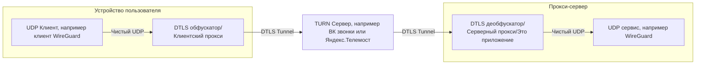

# Turn Proxy

## Отказ от ответственности (дисклеймер)
Данный проект является исследовательским, автор не несёт ответственности за использование его трудов для обхода
блокировок запрещённых сервисов. Также автор не ручается за нарушение пользовательского соглашения провайдеров сервисов,
предоставляющих услуги видеозвонков.

## Что этот проект делает
Этот проект принимает DTLS пакеты от TURN серверов, используя их как прокси сервера меж условным клиентом и сервером,
данный проект является именно вторым.

Проще говоря, этот проект изучает как работают видеозвонки в компьютерной сети "Интернет", позволяя передавать через них
не только аудио и видео информацию, но вообще любую, при этом исключая MITM-атаку и анализ с помощью шифрования DTLS



## Развёртка
На данный момент доступны [`flake.nix`](./flake.nix) для пакетного менеджера Nix вместе с модулем для NixOS, а также
[`PKGBUILD`](./PKGBUILD) для Arch Linux

### NixOS
Для наилучшей операционной системы модно, можно и надо использовать модули, а если быть точнее, то модуль который
содержится во [`flake.nix`](./flake.nix).

В flake.nix
```nix
{
  inputs = {
    turn-proxy-server.url = "github:Urtyom-Alyanov/turn-proxy-server";
  };
  outputs = { turn-proxy-server }: {
    # импортируйте куда нибудь
    # модуль turn-proxy-server.nixosModules.default
  };
}
```
В самой конфигурации:
```nix
{
  services.turn-proxy = {
    enable = true; # Включаем шарманку
    config = {
      listeningOn = "0.0.0.0:56000"; # Адрес, который слушает программа, то есть куда будет обращаться TURN сервер с зашифрованным (с помощью DTLS) трафиком (адресант)
      proxyInto = "127.0.0.1:51820"; # Адрес, куда будет высылаться расшифрованный UDP-трафик (адресат)
    };
    configFile = ./config.toml; # Также никто не мешает указать просто файл с конфигурацией
    # Также есть ещё аргумент package, чтобы задать кастомный бинарник
  };
}
```

### Для Arch Linux (PKGBUILD)
```shell
# Когда опубликуется на AUR
#git clone [https://aur.archlinux.org/turn-proxy-server-rs.git](https://aur.archlinux.org/turn-proxy-server-rs.git)
#cd turn-proxy-server-rs
#makepkg -si

# Поэтому пока так
git clone [https://github.com/Urtyom-Alyanov/turn-proxy-server.git](https://aur.archlinux.org/turn-proxy-server.git)
cd turn-proxy-server
makepkg -si
```

### Dockerfile
Также есть [Dockerfile](./Dockerfile), но сам пакет не опубликован на Dockerhub, делайте с ним что хотите.

## Использование
По умолчанию программа ищет конфигурацию в `/etc/turn-proxy/server/config.toml`, однако можно задать и иной путь
с помощью `--config {путь}`.

Конфигурационный файл имеет следующую структуру:
```toml
[common]
listening_on = "0.0.0.0:56000" # Адрес, который слушает программа, то есть куда будет обращаться TURN сервер с зашифрованным (с помощью DTLS) трафиком (адресант)
proxy_into = "127.0.0.1:51820" # Адрес, куда будет высылаться расшифрованный UDP-трафик (адресат)
```

Также можно указать **вручную**:
```shell
turn-proxy-server --no_config --listening_on=0.0.0.0:56000 --proxy_into=127.0.0.1:51820
```

В качестве адресата можно использовать любые протоколы, работающие поверх UDP, например WireGuard или Hysteria2.

**ПРИ ИСПОЛЬЗОВАНИИ WIREGUARD рекомендуется поставить MTU равным 1280-1380, так как TURN и DTLS добавляют свои заголовки,
что может привести к фрагментации пакетов, так как пакеты могут уже не влезать в стандартное ограничение в 1500 байт,
что приведёт к резкому снижению скорости, а она и так невелика.**

## УВАЖУХА И РЕСПЕКТ
- https://github.com/cacggghp/vk-turn-proxy - за идею, этот проект как раз является развитием идеи проекта за авторством
  cacggghp, только на языке Rust и более качественной дистрибуцией, распространяется под GPLv3 для сервера и MIT
  для клиента, написан на Go.
- https://github.com/MYSOREZ/vk-turn-proxy-android - за идею реализации более качественной дистрибуции, распространяется
  под GPLv3, написан на Kotlin.

---
_Данный проект лицензирован под [AGPL-v3](./LICENSE)_